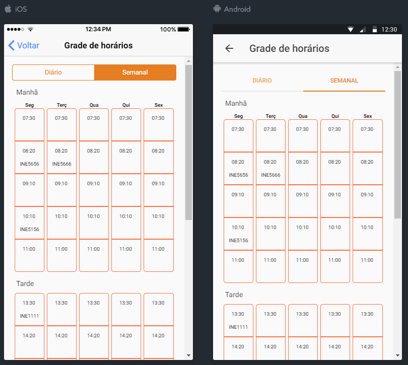

# Campos

- Dia da semana;
- Horário de início da disciplina;
- Sala de aula.

# Regras

**1.** Sobre os dias que não possuírem disciplinas alocadas:

- Caso não seja fim de semana: Exibir o dia normalmente, porém apresentar a mensagem: "Não há aulas de nenhuma disciplina neste dia";
- Caso seja fim de semana: Não exibir o dia.

**2.** Os nomes das disciplinas não devem ser traduzidos para outros idiomas.

**3.** Ao selecionar uma disciplina da listagem, redirecionar o usuário para a tela de detalhe da disciplina .

# Internacionalização

| Português	| Inglês	| Espanhol 	|
| --------- | --------- | --------- |
| Segunda	| Monday	| Lunes		|
| Terça		| Tuesday	| Martes	|
| Quarta	| Wednesday	| Miércoles	|
| Quinta	| Thursday	| Jueves	|
| Sexta		| Friday	| Viernes	|
| Sábado	| Saturday	| Sábado	|

# Protótipos de tela

 *Protótipo 1 - Horário semanal.*