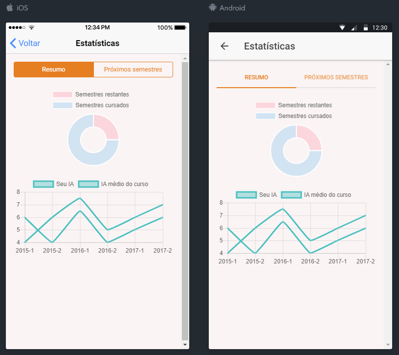
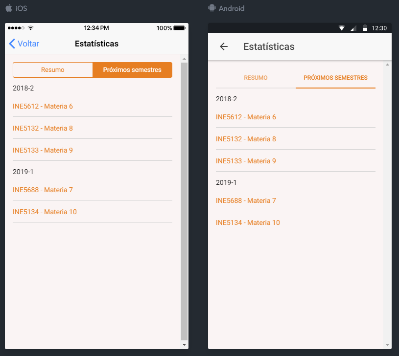

# Resumo

É composto pelo resumo da formação do aluno, desde sua entrada na UFSC.

Composto por:

- Gráfico de semestres;
- Gráfico de IA.

O gráfico de semestres é composto por:

- Semestres cursados, o qual é calculado a partir do semestre de entrada do aluno na UFSC;
- Semestres restantes, o qual é calculado a partir da geração de próximos semestres do próprio aplicativo.

O gráfico de IA é composto por:

- Seu IA, populado pelo IA do aluno no decorrer dos semestres;
- IA médio do curso, populado pelo IA médio do curso no decorrer dos semestres.

# Próximos semestres

Composto pelos próximos semestres que devem ser cursados pelo aluno.

Os semestres são calculados levando em consideração o último semestre gerado através do app e que o aluno seja aprovado em todas as disciplinas.

Composto por:

- Semestre;
- Código;
- Descrição da disciplina.

# Internacionalização

| Português                    | Inglês                  | Espanhol                     |
| ---------------------------- | ----------------------- | ---------------------------- |
| Estatísticas                 | Statistics              | Estadística                  |
| Resumo 					   | Resume                  | Resumen						|
| Próximos semestres           | Next semesters			 | Proximos semestres 	        |
| Semestres restantes          | Semesters remaining     | Semestres restantes          |
| Semestres cursados 		   | Completed semesters     | Semestres completos 			|
| Seu IA                       | Your IA                 | Su IA                        |
| IA médio do curso            | Average IA from course  | IA medio del curso 			|

### Protótipos de tela

 *Protótipo 1 - Resumo.*

 *Protótipo 2 - Próximos semestres.*