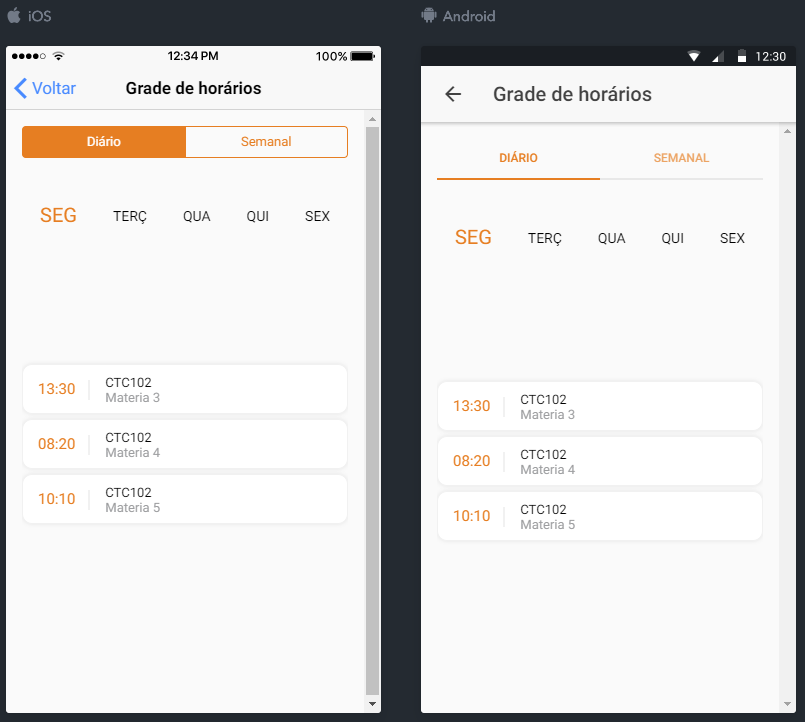
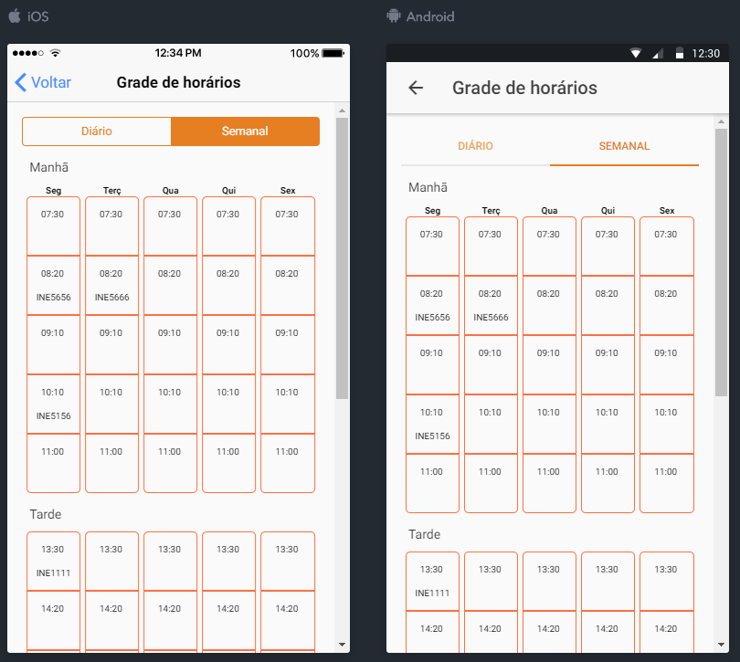

### Modos de exibição

- Diário;
- Semanal.

### Campos

- Diário:
	- Dia da semana;
	- Horário de início da disciplina;
	- Sala de aula;
	- Nome da disciplina.

- Semanal:
	- Dia da semana;
	- Horário de início da disciplina;
	- Sala de aula.

### Regras

**1.** O módulo deve ser aberto por padrão de acordo com o seguinte mapeamento:

- **Aba:** Diário;
- **Dia da semana:** Dia da semana no qual o aplicativo está sendo utilizado.

**2.** Sobre os dias que não possuírem disciplinas alocadas:

- Caso não seja fim de semana: Exibir o dia normalmente, porém apresentar a mensagem: "Não há aulas de nenhuma disciplina neste dia";
- Caso seja fim de semana: Não exibir o dia.

**3.** Os nomes das disciplinas não devem ser traduzidos para outros idiomas.

###### Diário

**4.** Para realizar a transição entre os dias da semana, o usuário deverá arrastar a tela para avançar (da direita para a esquerda) ou retroceder (da esquerda para a direita) entre os dias da semana.

**5.** Os dias da semana devem ser apresentados em sua forma abreviada.

**6.** O dia da semana que está sendo exibido deve receber um destaque de acordo com o seguinte protótipo. 

**7.** Ao selecionar uma disciplina da listagem, redirecionar o usuário para a tela de detalhes da disciplina .

###### Semanal

**8.** Ao selecionar uma disciplina da listagem, redirecionar o usuário para a tela de detalhe da disciplina .

### Internacionalização

| Português         | Inglês           | Espanhol            |
| ----------------- | ---------------- | ------------------- |
| Grade de horários | Timetable        | Horario de horarios |
| Diário            | Daily			   | Diario 			 |
| Semanal			| Weekly           | Semanal			 |

###### Diário

| Português | Inglês  | Espanhol |
| --------- | ------- | -------- |
| SEG       | MON     | LUN      |
| TERÇ 		| TUE     | MAR 	 |
| QUA       | WED     | MIÉ 	 |
| QUI       | THU     | JUE 	 |
| SEX       | FRI     | VIE 	 |
| SAB       | SAT     | SÁB 	 |

###### Semanal

| Português        | Inglês           | Espanhol           |
| ---------------- | ---------------- | ------------------ |
| Segunda		   | Monday           | Lunes              |
| Terça 		   | Tuesday          | Martes			   |
| Quarta		   | Wednesday        | Miércoles          |
| Quinta		   | Thursday         | Jueves             |
| Sexta			   | Friday    		  | Viernes 		   |
| Sábado		   | Saturday 		  | Sábado             |

# Protótipos de tela

 *Protótipo 1 - Horário diário.*

 *Protótipo 2 - Horário semanal.*